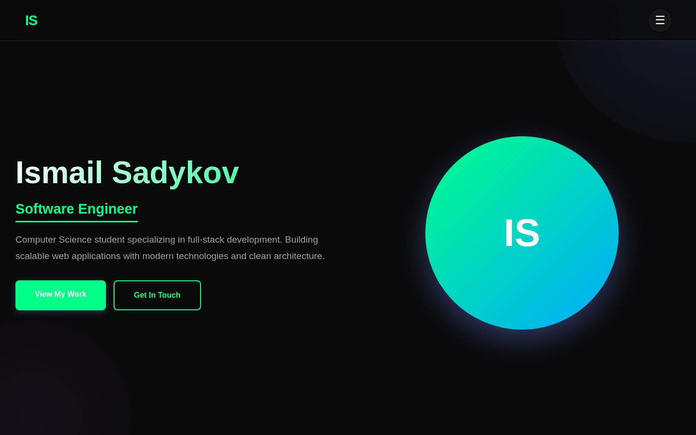
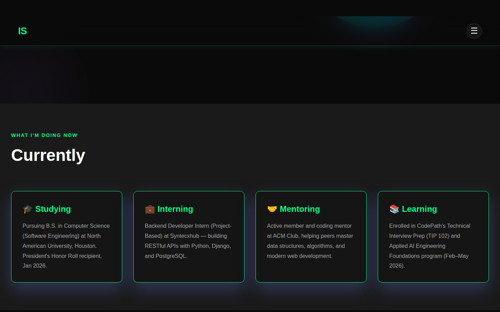
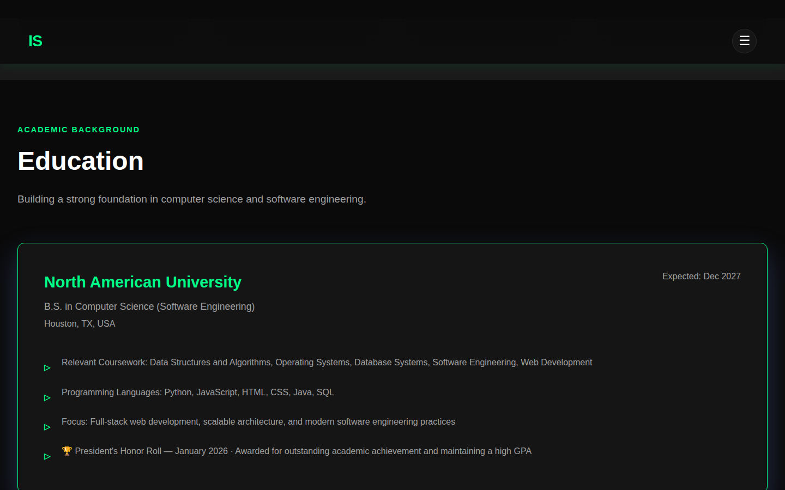
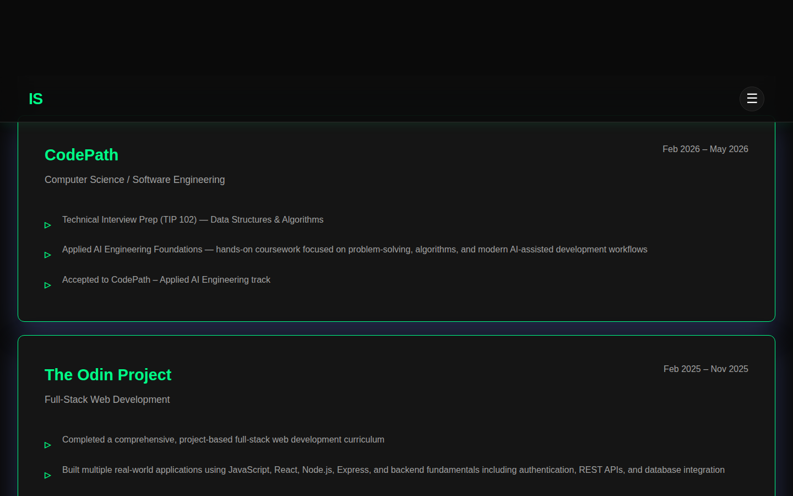
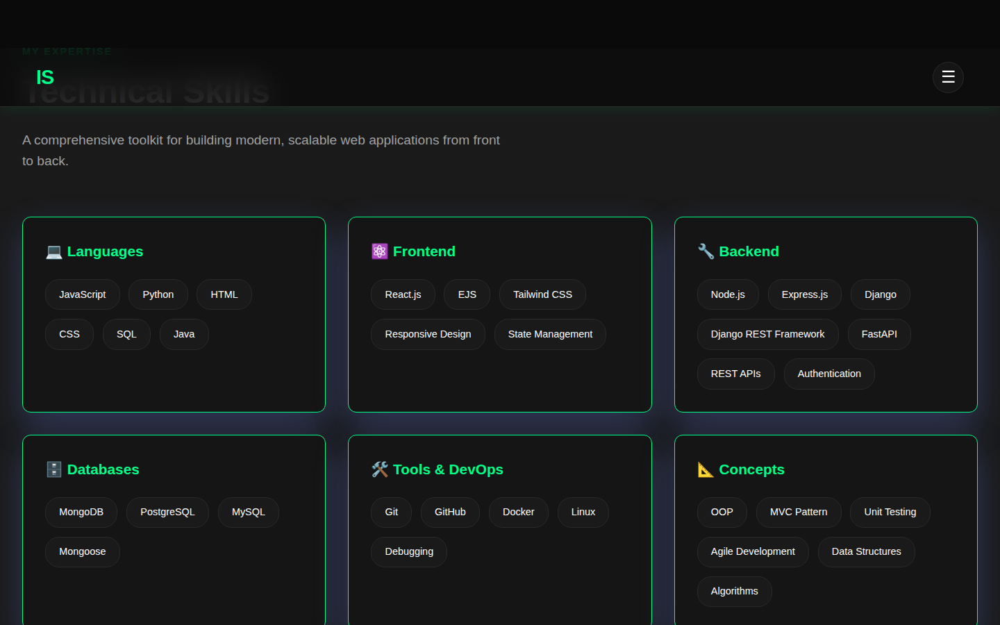
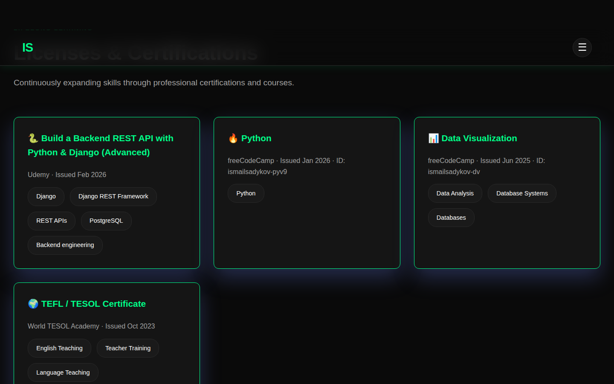
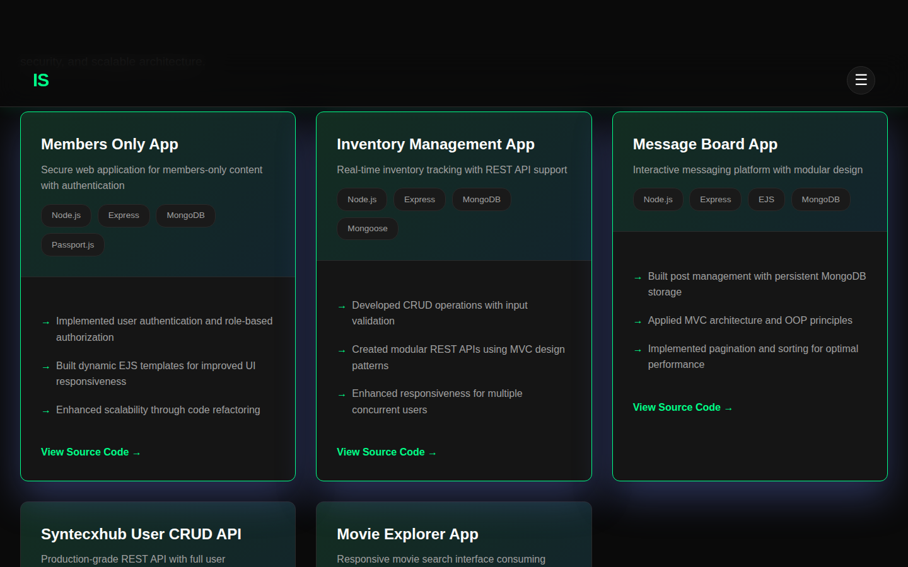
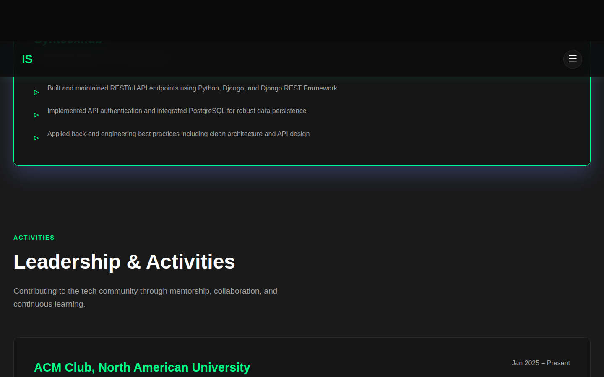
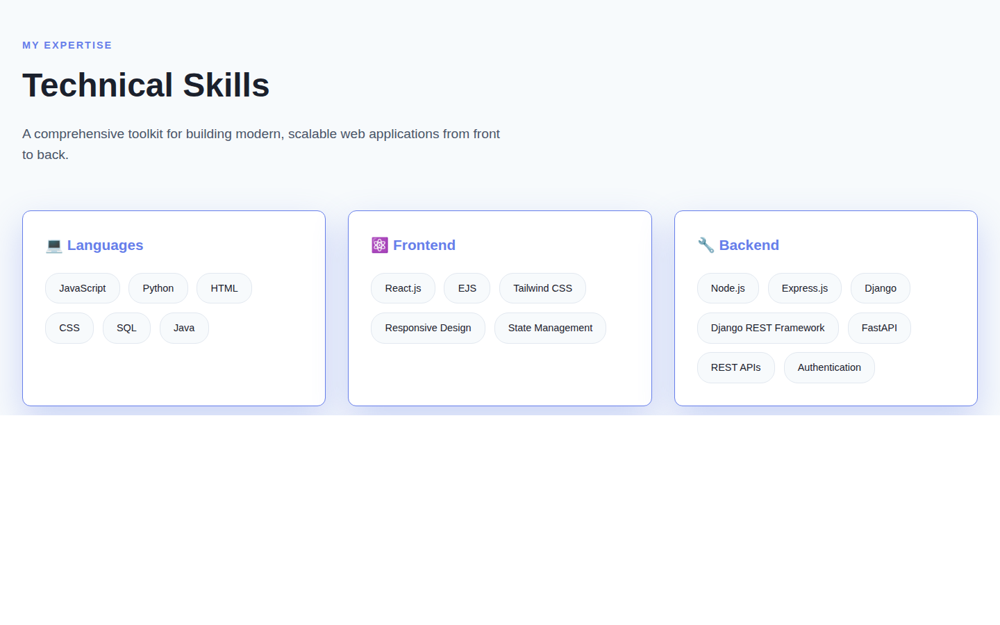

# Ismail Sadykov — Personal Portfolio

A clean, responsive personal portfolio website built with vanilla HTML, CSS, and JavaScript. Features dark/light mode, smooth scroll animations, and sections for experience, education, projects, and certifications.

🔗 **Live site:** [ismailsadykov.github.io/portfolio](https://sadykovIsmail.github.io/portfolio) <!-- update with your actual URL -->

---

## Screenshots

### Hero Section


### Currently Section


### Education Section


### Skills Section


### Certifications Section


### Projects Section


### Experience & Leadership


### Contact Section


### Light Mode


---

## Features

- **Dark / Light mode** — toggled from the nav menu, persisted in `localStorage`
- **Smooth scroll animations** — cards scale and fade as they enter the viewport via `IntersectionObserver`
- **Fully responsive** — adapts to mobile, tablet, and desktop
- **Zero dependencies** — plain HTML, CSS, and JS; no frameworks or build tools needed
- **Single file** — entire site lives in `index.html` for easy deployment

---

## Sections

| Section | Description |
|---|---|
| Hero | Name, title, and CTA buttons |
| Currently | Snapshot of what I'm doing right now |
| Education | NAU · CodePath · The Odin Project |
| Skills | Languages, frontend, backend, databases, tools, concepts |
| Certifications | Udemy, freeCodeCamp, World TESOL Academy |
| Projects | Featured full-stack and backend projects |
| Experience | Syntecxhub Backend Internship |
| Leadership & Activities | ACM Club, Educational Volunteering |
| Contact | Email, phone, GitHub, LinkedIn |

---

## Tech Stack

**Frontend**
- HTML5, CSS3, JavaScript (ES6+)
- CSS custom properties (variables) for theming
- `IntersectionObserver` API for scroll animations
- `localStorage` for theme persistence

**Projects showcased**
- Python · Django · Django REST Framework · PostgreSQL
- Node.js · Express.js · MongoDB · Mongoose
- React.js · Tailwind CSS · EJS
- REST APIs · Authentication · MVC

---

## Getting Started

No build step required — just open the file in a browser.

```bash
git clone https://github.com/sadykovIsmail/portfolio.git
cd portfolio
open index.html        # macOS
# or
xdg-open index.html    # Linux
# or double-click index.html in your file explorer
```

---

## Adding Screenshots

To populate the screenshot images referenced in this README:

1. Open `index.html` in a browser
2. Use your browser's screenshot tool or a tool like [Screely](https://screely.com) or [Carbon](https://carbon.now.sh)
3. Save screenshots to the `screenshots/` folder using the filenames above:
   - `hero.png`
   - `currently.png`
   - `education.png`
   - `skills.png`
   - `certifications.png`
   - `projects.png`
   - `experience.png`
   - `contact.png`
   - `light-mode.png`

---

## Deployment

The site is a single static HTML file — it can be deployed anywhere:

- **GitHub Pages** — push to `main` and enable Pages in repo settings
- **Netlify / Vercel** — drag and drop the folder or connect the repo
- **Any static host** — just upload `index.html`

---

## Contact

| Platform | Link |
|---|---|
| Email | career.sadykov@gmail.com |
| LinkedIn | [linkedin.com/in/ismailsadykov](https://linkedin.com/in/ismailsadykov) |
| GitHub | [github.com/sadykovIsmail](https://github.com/sadykovIsmail) |

---

&copy; 2026 Ismail Sadykov
